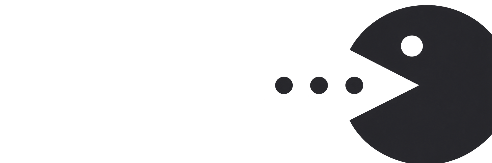

# agentlayer — iTerm2+tmux 멀티 에이전트 관제탑

tmux 안에서 돌아가는 Claude Code / Codex / Gemini 에이전트들이
**누가 일하는 중이고, 누가 입력을 기다리고, 누가 끝났는데 아직 안 봤는지**를
한 화면에서 보여주는 터미널 도구.

Orca ADE의 관제 기능을 일반 tmux 위에 재현한다 — 자체 터미널도, GUI도,
데몬도 없다. tmux가 이미 잘하는 것(세션 유지, SSH 재접속)은 tmux에 맡기고,
tmux가 모르는 것(에이전트의 의미 상태)만 채운다.

[coach](https://github.com/netwaif/usage-coach)(사용량 코칭) ·
[mat](https://github.com/netwaif/mat)(MultiAgent 작업 관제)의 자매 도구.

## 상태 모델

```
● WORK   일하는 중 (hook heartbeat)
◆ WAIT   사용자 입력·승인 대기  ← 가장 위에 정렬
✔ DONE   끝났는데 아직 안 봄 (읽음 처리 전까지 유지)
✖ ERR    비정상 종료
· idle   대기
  dead   pane 소실 (24시간 뒤 자동 정리)
```

상태는 **화면 스크래핑 없이** 에이전트 공식 hook과 tmux 메타데이터로만
판정한다. `DONE → idle` 전환은 반드시 사용자 행동(점프·읽음 키)으로만
일어난다 — "끝났는데 안 본 것"을 놓치지 않는 게 이 도구의 존재 이유다.

## 설치

```bash
brew install netwaif/tap/agentlayer
# 또는 소스 빌드 (Go 1.22+)
git clone https://github.com/netwaif/agentlayer.git && cd agentlayer
make install   # ~/.local/bin/agentlayer
```

설정은 한 번:

```bash
agentlayer init            # Claude hook 등록 (기존 hook 보존, 백업 생성)
agentlayer init --dry-run  # 뭘 바꾸는지 먼저 확인
```

tmux 팝업(`C-b a`)을 쓰려면 init이 안내하는 두 줄(bind-key + client-resized 훅)을 `.tmux.conf`에 추가한다. 훅은 터미널을 쪼갰다 합칠 때 팝업이 옛 크기로 남는 tmux 동작을 같은 자리에 다시 여는 것으로 보정한다(커서 유지).
agentlayer는 tmux 설정을 자동으로 수정하지 않는다.

## 사용

```bash
agentlayer            # TUI 관제탑 (j/k 이동, enter 점프+읽음, o 읽음, b 지목, s 캡처, p 프리뷰, u 사용량 뷰, r 새로고침, q 종료)
agentlayer status     # plain 표 — SSH·스크립트용
agentlayer status --json
agentlayer card       # Discord 상태 카드 업서트 (주기 실행용) / --out은 JSON만
agentlayer resume     # 죽은 claude 대화 목록 / resume <id>로 구조
agentlayer restore    # 재부팅 뒤 죽은 세션 배치 복원 — 체크리스트에서 골라 enter (space 토글, a 전체, q 취소)
agentlayer restore --resume       # 대화까지 이어서 복원 (같은 체크리스트) / --yes는 체크 없이 전부 / --dry-run은 계획만
agentlayer restore <id> ...       # ID 지정 복원. LaunchAgent 봇·이미 pane 있는 자리는 자동 제외 (봇은 ID 지정 시 강제)
agentlayer wake-all   # 모든 claude·codex 세션에 "세션 이어서하자" 일괄 전송
agentlayer close-all  # "세션 마감하자" 전송 → 전원 완료(DONE)까지 감시 → 요약
agentlayer broadcast "<메시지>"   # 임의 메시지 일괄 전송 (--except로 제외, --yes로 무확인)
agentlayer info <세션>            # 배선 상세 카드: 폴더·엔진·Discord 채널·구동 주체·resume 경로
agentlayer wt ...     # worktree 병렬 모드 (아래 참고)
agentlayer browser ...            # 에이전트 전용 브라우저 (아래 참고)
```

## 에이전트별 상태 신호

| 에이전트 | 신호 | 상태 |
|---|---|---|
| Claude Code | hooks (PostToolUse/Notification/Stop) | WORK/WAIT/DONE 전부 |
| Codex | config.toml notify (turn-complete) | DONE (나머지는 스캐너) |
| Gemini | 프로세스·pane 감지 | 존재·소실만 (lifecycle 신호 없음) |

`agentlayer init` 한 번으로 Claude hook과 Codex notify가 함께 등록된다
(기존 설정 보존·백업·멱등).

## 사용량·컨텍스트 (선택적 통합)

[usage-coach](https://github.com/netwaif/usage-coach)가 설치돼 있으면:

- TUI 헤더에 provider별 요약 한 줄, `u` 키로 전용 뷰(게이지·리셋·코칭)
- 각 에이전트 행에 모델·컨텍스트%·마지막 활동 (statusline 스냅샷 + codex rollout)
- coach 콜드 실행이 느려도 5분 파일 캐시 + 중복 실행 방지로 TUI는 블로킹되지 않는다

## 알림·Discord

`~/.config/agentlayer/config.json`:

```json
{
  "discord_webhook_url": "https://discord.com/api/webhooks/...",
  "notify_webhook_url": "https://discord.com/api/webhooks/...",
  "notify_macos": true,
  "notify_discord": false
}
```

- 에이전트가 **완료(DONE)** 되거나 **입력 대기(WAIT)** 로 바뀐 순간에만 알림 1회
  (heartbeat는 무음) — macOS 알림 + (켜면) Discord 단문
- `notify_webhook_url`(선택): 단문 알림을 별도 알림 채널로 분리. 비우면 카드
  웹훅으로 감. 분리하면 대시보드 채널이 카드 한 장짜리로 유지돼 스크롤이 없다
- `agentlayer card`는 사용량 + 에이전트 상태를 Discord 메시지 하나로 계속
  업서트하고, provider level이 악화되면 새 메시지로 핑한다.
  LaunchAgent 등으로 5분 주기 실행을 권장
- `preview_interval`(선택): TUI 미리보기 갱신 주기. Go duration 문자열
  (`"500ms"`, `"2s"`). 기본 `1s`, 하한 200ms(그 아래는 200ms로 보정).
  목록 폴링(2초)과는 별개로 미리보기만 조절된다. TUI 재시작 시 적용
- `worker_auto_approve`(선택, 기본 true): `wt new`로 띄우는 gemini worker를 승인 없이
  돌린다(agy `--dangerously-skip-permissions`, stock gemini `--yolo`). claude·codex는 각자
  설정(auto 모드·trusted)을 따른다. false면 gemini worker가 도구마다 승인을 묻는다
- `preview_auto`(선택): 에이전트 폴더 아래에 새 dev 서버가 뜨면 전용 브라우저에
  자동으로 연다. 기본 `true`. 에이전트 hook(상태 전이)마다 백그라운드로 스캔하므로
  관제탑이 닫혀 있어도 동작한다(스캔 5초 스로틀). 같은 서버는 한 번만, 이미 탭이
  있으면 안 열고(앞으로 끌어오지도 않음), 서버를 내렸다 다시 띄우면 다시 연다.
  전용 브라우저가 떠 있을 때만 동작하며 닫아 둔 브라우저를 띄우지 않는다.
  `false`면 뱃지만 붙고 `p`로 연다
- `browser_port`(선택): 전용 브라우저 CDP 디버깅 포트. 기본 `9222`.
  MCP 설정이 이 주소를 고정으로 보므로 바꾸면 `agentlayer browser mcp`를 다시 등록
- `browser_fx`(선택): 에이전트가 브라우저를 조작할 때 AI 커서·테두리 글로우를
  그린다. 기본 `true`. `false`면 효과만 꺼진다(아래 "조작 효과")

## Worktree 병렬 모드

같은 저장소에서 여러 에이전트(claude/codex/gemini 혼합 자유)가 서로 파일을
밟지 않고 병렬 작업하게 한다. 명령 하나가 worktree + `agent/<task>` 브랜치 +
tmux window + 에이전트 실행까지 만든다.

```bash
agentlayer wt new auth-api --agent claude --test 'go test ./...'
agentlayer wt new login-ui --agent codex        # 같은 repo, 충돌 없음
agentlayer wt list                              # dirty·미병합·테스트 상태 한눈에
agentlayer wt diff auth-api                     # base 대비 변경
agentlayer wt test auth-api                     # 테스트 실행·기록
agentlayer wt review auth-api                   # 리뷰 파일 생성 → "#> 코멘트" 작성
agentlayer wt send auth-api                     # 코멘트를 에이전트에 수정 지시로 전송
agentlayer wt merge auth-api                    # 검사 요약 + 명령 안내 + y 확인 후 병합
agentlayer wt clean auth-api                    # 보존 우선 정리
```

- **자동 merge 없음** — merge는 항상 안내 + 명시적 확인
- **보존 우선 정리** — 미커밋·untracked·미병합 커밋이 하나라도 있으면 clean 거부
- worktree는 `<repo>/.agentlayer/worktrees/<task>`에, 메타는 상태 디렉터리에 기록

- **말로 시키는 오케스트레이션**: 코디네이터 세션에 "claude랑 codex한테 A/B로
  시켜봐"라고 하면 `orchestration` 스킬(`agentlayer init`이 설치)이 `wt new` →
  2단 dispatch → `status` 폴링 → 취합 절차를 대신 밟는다. 머지는 사용자가 고른다.
  worker의 브라우저 일은 `agent-browser` 스킬 규칙(자기 탭·chrome-devtools MCP)을 따른다

## 에이전트 전용 브라우저

에이전트가 만든 웹 화면을 사람이 직접 보고, 본 것(요소 지목·스크린샷·콘솔
에러)을 다시 담당 에이전트 pane으로 돌려주는 전용 Chrome 관제.

```bash
agentlayer browser                 # 전용 브라우저 기동 (떠 있으면 기존 인스턴스에 attach)
agentlayer browser pick [--agent <id>]   # 활성 탭에서 요소 클릭 → 오버레이에 지시 입력 → 담당 에이전트 pane으로 한 줄 전송 (연속 지목, Ctrl-C 종료)
agentlayer browser pick --once           # 한 번 지목하고 요청 한 줄을 stdout으로 — 에이전트가 "브라우저에서 지목할게"를 받아 직접 실행하는 경로
agentlayer browser open <url>      # 전용 브라우저에 탭 열기 (터미널 링크 클릭을 여기로 보내는 진입점)
agentlayer browser shot [url] [--send] [--notify] [--agent <id>]   # 전체 페이지 스크린샷 — 경로 출력, --send면 담당 에이전트 pane, --notify면 알림 웹훅(폰 Discord)으로 이미지 전송
agentlayer browser errors [--send]       # 콘솔 에러·JS 예외를 Enter까지 수집해 덤프(stdout+파일), --send면 pane 전송
agentlayer browser preview [포트...]     # worktree dev 서버(또는 지정 포트)를 브랜치 라벨(⎇) 창으로 열기
agentlayer browser cookies import <도메인...> [--profile <이름>]  # 실사용 크롬의 지정 도메인 쿠키만 골라 전용 프로필로 가져오기 (macOS, 프로필은 쿠키 많은 쪽 자동)
agentlayer browser cookies list [도메인...]     # 전용 프로필에 있는 쿠키 현황 — 호스트별 개수, 도메인 지정 시 이름·만료 (값은 안 보임)
agentlayer browser cookies clear <도메인...>    # 전용 프로필에서 지정 도메인 쿠키만 지우기 (로그아웃, 실사용 크롬은 무관)
agentlayer browser cookies export <도메인> [이름] --to <파일> [--format value|netscape|json]  # 쿠키를 파일로만 내보내기 (0600, 화면엔 값 안 찍힘) — 이름 있으면 값 한 줄, 없으면 yt-dlp·curl용 cookies.txt
agentlayer browser cookies export <도메인> <이름> --env <.env파일> <KEY>  # .env의 KEY= 줄만 그 쿠키 값으로 갱신 (봇·스크립트 설정 주입)
agentlayer browser mcp             # claude·codex·gemini에 chrome-devtools-mcp를 이 브라우저로 붙이는 설치 명령 출력
```

- **말로 시켜도 된다**: 지금 대화 중인 세션이 대상이면 관제탑을 열 필요 없이
  "브라우저에서 지목할게"·"스크린샷 확인해봐"·"콘솔 에러 확인해봐"·"x.com 쿠키
  가져와줘"라고 하면 된다. `agent-browser` 스킬(`agentlayer init`이 `~/.claude/skills`에
  설치)이 `pick --once`·`shot`·`errors --reload`·`cookies`를 대신 실행하고 결과를
  읽는다. 관제탑 키는 여러 에이전트 중 대상을 고를 때 쓴다
- **관제탑에서 키 하나로**: 에이전트 행을 고르고 `b`(요소 지목)·`s`(활성 탭
  캡처)를 누르면 그 에이전트 pane으로 바로 간다(후보 선택 없음). 에이전트
  폴더 아래에서 dev 서버가 listen 중이면 행 끝에 `🌐:3000` 뱃지가 붙는다. 처음
  보는 서버는 관제탑이 닫혀 있어도 hook이 자동으로 전용 브라우저 창(⎇브랜치
  제목)에 연다(`preview_auto`). `p`는 그 서버를 다시 연다. 위 명령들은 이 키들이
  뒤에서 부르는 배관이다
- **엔진은 Chrome for Testing** — 구글이 자동화용으로 배포하는 정식 Chrome을
  첫 기동 때 한 번 `~/.local/state/agentlayer/chrome-for-testing/`에 내려받는다
  (약 200MB, 십수 초). 시스템 Chrome을 전용 프로필로 띄우면 macOS가 그 프로세스를
  "Google Chrome"으로 등록해, Dock·Spotlight에서 Chrome을 열어도 실사용 크롬이
  뜨지 않고 에이전트 브라우저에 창만 추가된다. 번들 ID가 다른 Chrome for Testing은
  별개 앱이라 섞이지 않는다. 코덱은 실Chrome과 같고 Widevine DRM만 없다.
  내려받기에 실패하면 시스템 Chrome으로 대체한다(위 Dock 문제는 남음). 엔진을
  새 버전으로 바꾸려면 그 폴더를 지우면 다음 기동 때 다시 받는다
- **조작 효과(FX)** — 에이전트가 MCP로 클릭·입력·드래그·스크립트를 실행하는 동안
  뷰포트 안쪽 테두리에 테라코타 글로우가 켜지고, "AI" 뱃지가 달린 커서가 CDP
  마우스 이벤트를 따라 움직이며 클릭 지점에 리플, 입력 중인 요소에 하이라이트가
  뜨고, 상단에 "AI 조작 중" 표식이 붙는다. 사람이 "지금 AI가 손대고 있다"를 보게
  하는 장치다. 도구 호출이 이어지는 동안 켜져 있고 마지막 응답 뒤 2.5초 유지된다
  (호출 하나는 수백 ms라 즉시 끄면 보이지 않는다). 구현은 `mcp-serve` 프록시가 도구 호출의
  시작·끝을 CDP로 페이지에 알리고, 기동 시 프로필에 붙인 작은 확장
  (`~/.local/state/agentlayer/browser-fx/`, 콘텐츠 스크립트)이 그린다.
  Chrome for Testing 전용(브랜드 Chrome 137+는 확장 로드 플래그를 무시 → 효과만
  없음). 이미 떠 있는 브라우저에는 다음 기동부터 붙는다. `browser_fx: false`로 끔
- 전용 프로필 `~/.local/state/agentlayer/browser-profile`로 뜬다 —
  로그인 세션은 이 프로필에 보존되고, 실사용 Chrome과 격리된다.
  기동 시 프로필에 다크·중성 회색 테마(Claude Desktop 다크 톤)와 프로필 이름
  (AgentLayer, 우상단 프로필 메뉴)을 심는다. Customize Chrome에서 테마를 바꾸면
  그 선택을 존중한다. 실사용 Chrome과의 구분은 북마크바 등 사용자 몫
- CDP 디버깅 포트는 고정(`browser_port`, 기본 9222)이라 재부팅 뒤에도
  기록 없이 같은 브라우저를 찾아 attach한다. 포트를 다른 프로세스가
  물고 있으면 명시적으로 실패한다 — config에서 포트를 바꾸면 된다
- **에이전트가 직접 조작·검사(클릭·입력·콘솔·네트워크)하는 건 MCP** —
  agentlayer는 제어 기능을 자체 구현하지 않고 chrome-devtools-mcp에 위임한다.
  `agentlayer init`이 claude(`~/.claude.json`)·codex(`~/.codex/config.toml`)·
  gemini(`~/.gemini/settings.json`)에 MCP 서버 `chrome-devtools`를 등록한다
  (백업 `.agentlayer.bak`, 같은 이름의 기존 항목은 건드리지 않음). 서버 명령은
  `agentlayer browser mcp-serve`라 에이전트가 브라우저 도구를 부르는 순간
  Chrome이 없으면 띄우고 chrome-devtools-mcp로 넘긴다 — 기동 명령이 따로 없다.
  세 에이전트는 같은 로그인 브라우저를 공유하되 각자 자기 탭에서 작업한다.
  수동 등록이 필요하면 `agentlayer browser mcp`가 명령을 출력한다. Playwright
  MCP를 쓰려면 `npx @playwright/mcp --cdp-endpoint http://127.0.0.1:9222`
- `cookies import`는 2FA 재로그인이 번거로운 사이트용 — 실사용 크롬에서
  지정 도메인 쿠키만 복호화해 전용 프로필에 심는다(전체 프로필 복사가 아님).
  실행 시 macOS Keychain 접근 팝업이 뜨면 '항상 허용'을 눌러야 한다.
  실사용 Chrome에 프로필(계정)이 여럿이면 그 도메인 쿠키가 가장 많은 프로필을
  고르고 어느 것인지 출력한다 — 다른 프로필은 `--profile "Profile 1"`처럼 지정
  예: `agentlayer browser cookies import youtube.com google.com`
  무엇이 들어 있는지는 `cookies list`(호스트별 개수)·`cookies list x.com`(이름·만료)으로
  보고, 다 쓴 로그인은 `cookies clear x.com`처럼 그 도메인만 지운다 — 다른 사이트
  로그인과 실사용 Chrome은 그대로다
- `cookies export`는 "브라우저에선 되는데 자동화만 하면 로그인에서 막히는" 도구
  (사용량 모니터·yt-dlp·notebooklm CLI·감시 봇)에 세션을 넘겨주는 통로 — 값은
  파일(0600)로만 가고 터미널·로그·Discord에는 요약("… → 파일 기록, 만료 날짜")만
  남는다. 에이전트에게 "claude.ai 세션 키 꺼내서 ~/bot/.env에 넣어줘"라고 하면
  `cookies export claude.ai sessionKey --env ~/bot/.env CLAUDE_SESSION_KEY`를 치고
  값은 에이전트도 보지 않는다. 만료되면 같은 말을 다시 하면 된다(healthcheck 뒤 갱신)
- **구글 계정은 예외** — 구글은 세션 쿠키(`__Secure-1PSIDTS`)를 주기적으로 회전시켜서
  같은 세션의 복사본이 두 곳에서 쓰이면 한쪽이 회전한 순간 다른 쪽이 죽는다.
  `cookies import google.com`은 형식상 들어가지만 실사용 Chrome이 계속 회전시키므로
  복사본은 첫 요청에서 무효화되고 로그인 쿠키 19개가 지워진다(2026-09-06 실측).
  에이전트 브라우저에서 구글이 필요하면 그 창에서 직접 로그인해 **별도 세션**을 만들고,
  notebooklm CLI 같은 구글 도구도 그 도구의 `login`으로 자기 세션을 갖게 한다.
  import는 안착 확인을 하므로 Chrome이 조용히 거부한 쿠키가 있으면 이름을 보고한다
- MCP 스크린샷은 Chrome에 화면 잠자기 방지 잠금("Capturing")을 남길 때가 있어
  모니터가 안 꺼진다 — hook이 에이전트 브라우저에 그런 잠금을 보면 탭마다 1×1
  캡처를 완료시켜 풀어 준다(자동, 30초 간격). 에이전트 브라우저는 재기동 때 이전
  탭을 복원하지 않는다(매번 깨끗하게 시작)
- pick 산출물(요소 컨텍스트 `.md` + 스크린샷 `.png`)과 shot·errors 덤프는
  `~/.local/state/agentlayer/picks/`에 저장된다
- **터미널 링크를 전용 브라우저로**: 기본은 ⌘-클릭이 실사용 브라우저로 간다.
  iTerm2 → Settings → Profiles → (쓰는 프로필) → Advanced → Smart Selection
  "Edit…" → `+`로 규칙 추가: Regex `https?://[^\s"'<>)]+`, Precision Very High,
  Actions에 "Run Command" / Parameter `~/.local/bin/agentlayer browser open "\0"`.
  Smart Selection 규칙에 액션이 있으면 ⌘-클릭이 첫 액션을 실행하므로 링크가
  전용 브라우저에 열린다(에이전트가 보는 화면 = 사람이 클릭한 화면). 시스템
  브라우저로 열고 싶을 땐 우클릭 → Open URL. (Semantic History는 파일 경로
  전용이라 URL에는 안 걸린다)
- **SSH 원격에서 쓸 때**: 에이전트(MCP)는 Mac의 전용 브라우저를 그대로
  조작한다(Mac이 GUI 로그인 상태면 됨). 사람이 화면을 보는 방법은 두 가지 —
  ① `agentlayer browser shot --notify`로 스크린샷을 알림 웹훅(폰 Discord)으로
  받기, ② 노트북이면 `ssh -L 9222:127.0.0.1:9222 <mac>` 뒤 노트북 Chrome의
  `chrome://inspect` → Configure에 `localhost:9222` 등록 → inspect로 전용
  브라우저 탭을 실시간으로 보고 클릭까지 할 수 있다
- 전송 대상 라우팅: 페이지가 localhost면 포트를 `lsof`로 역추적해
  dev 서버의 작업 폴더와 에이전트 폴더를 최장일치로 대조한다.
  좁혀지지 않으면 산 에이전트 전원이 후보가 된다

## 안전 원칙

- 기존 tmux 세션·window·pane을 절대 kill하지 않는다
- 기존 prefix·키 바인딩을 변경하지 않는다 (`C-b a`는 옵트인)
- settings.json 수정 전 백업(`settings.json.agentlayer.bak`)을 만든다
- 상태 파일(`~/.local/state/agentlayer/`)에 인증정보를 쓰지 않는다
- Mac이 sleep/재부팅하면 tmux와 에이전트 프로세스는 유지되지 않는다
  (tmux-resurrect 등과 병용 권장)

## 로드맵

- **Phase 1 ✔**: 상태 관제 코어 — TUI·status CLI·Claude hook
- **Phase 2 ✔**: 사용량 뷰(coach 통합)·macOS/Discord 알림·Discord 상태 카드
- **Phase 3 ✔**: worktree 병렬 모드 — 생성·diff 코멘트 회신·테스트 수집·보존 우선 정리
- **Phase 4 ✔**: Codex 어댑터·MultiAgent 패널·비상 resume·배포 준비
- **v1.0 ✔**: Gemini(Antigravity CLI·stock CLI) 완전 편입 — hook 상태추적·모델·ctx(근사)·resume,
  3사 그룹 정렬·구분선, 기본모델 헤더(Fable 경고), GitHub 공개 + brew tap
